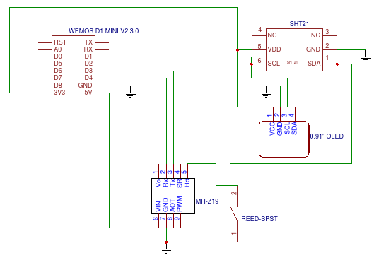

# CO2/Humidity/Temperature Sensor with Oled

Code is AS-IS without any warranty of any kind...

Code for display can be found here: https://github.com/adafruit/Adafruit_SSD1306

Hardware used :
* Wemos D1 mini (but any ESP8266 breakout with enough pins should do)
* 0.91 Inch 128x32 I2C SSD1306 OLED Display
* MH-Z19 CO2 sensor
* SHT21/HTU21D Temperature/Humidity sensor

Corresponding blog entry: http://www.guillier.org/blog/2017/09/co2humiditytemperature-sensor/
